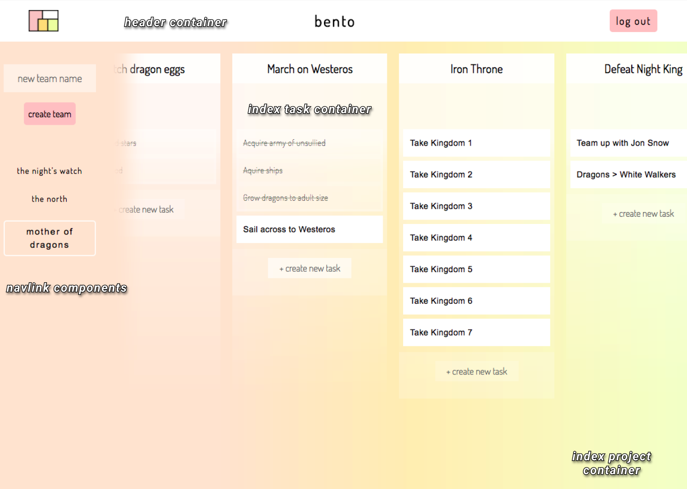
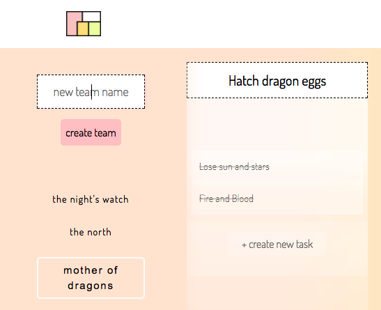

# Bento

  [Bento][live-link] is an organization and task management tool designed for creatives and small-to-medium structured companies, inspired by [Asana][asana] & [Trello][trello]. Bento uses React/Redux, a PostGreSQL database, and Ruby on Rails, living as a full-stack, single-page web application.

## Features

  * User accounts with secure authentication through both the RoR backend and the R/R frontend
  * Users can belong to organizational structures called teams which have their own separate dashboards
  * Each team has a selection of project panels that can be used in a variety of different ways to organize tasks and management of team accountability
  * Team members can obfuscate completed tasks while keeping them easily accessible in their project panels
  * As tasks and projects are completed, new teams can be formed to create new sets of projects

### Rendering

  Teams, Projects, and Tasks are organized into separate React components. Each individual list component can be separately arranged within the base skeleton with a great deal of emphasis on future-proofing through a modular DRY layout.

  

### Input

  Bento has consistent user input fields throughout the entirety of its dashboard view. Project titles are live input fields that can be changed on the fly, and directly match the input fields for Creating new Projects and Teams. Task creation is slotted at the bottom of Project panels where it is unobtrusive and within easy reach.

  

### Redux Reducer, Api Request, Thunk Action Creators

  The below code shows a snapshot of the `Switch` used in the Bento's `ProjectReducer` for obtaining data objects from the Rails backend. Bento makes Api Requests utilizing Thunk Action Creators to fire off AJAX calls for payloads. Promises are returned back up the chain, passing a response to an Action Creator, which is then passed as a payload to be destructured by the reducer and create a new State based on a particular `Case`.


```js
const ProjectReducer = (state = startState, action) => {
  Object.freeze(state);

  switch (action.type) {
    case RECEIVE_PROJECT:
      action.project.tasks = {};
      let newProject = {[action.project.id]: action.project};
      return merge({}, state, newProject);
    case RECEIVE_ALL_PROJECTS:
      return action.projects;
    case CLEAR_STORE:
      return startState;
    case RECEIVE_TASK:
      let taskProject = state[action.task.project_id];

      taskProject.tasks[action.task.id] = action.task;
      return merge({}, state, {[action.task.project_id]: taskProject})
    default:
      return state;
  }
};
```

### Filtering projects by teams

  Bento's schema is structured with a join table for `Memberships` through ActiveRecord models.

  * a user `has_many :teams`
  * a team `has_many :users`
  * by association `through: :memberships`

  This allows for easy access in the Dashboard view.

```ruby
class Api::MembershipsController < ApplicationController
  def create
    @membership = Membership.new(user_id: current_user.id, team_id: params[:membership][:team_id])

    ...
```

  The frontend Dashboard page rendered simply as `/` root contains the entire view broken down into modular components. Teams render based on Memberships. Only the current user's teams will render, and only those teams' projects will be fetched.

  Multiple Users can be Members of the same team, allowing different offices or team members to share the same organizational boards remotely.

### Delivery

  Bento was conceptualized and implemented as a Minimum Viable Product over a two-week period. The [Project Proposal][dev-readme] outlines the particular MVP features aimed for, the timeline for completing each portion of the overall application, and some additional documents and early design wireframes.

### Future Roadmap

  Bento has several additional planned features with productivity and thorough UI/UX mechanisms in mind that will be developed over time as a passion project outside this initial exercise. The design is for a minimalist, pleasant organizational experience that takes as little time as possible to interact with, with maximum effect of data absorption.

#### Particular planned features

  * wrapping with [Electron][electron] to make a simple cross-platform desktop application from the skeleton of the web application
  * a night skin, partly implemented but not yet launched, allowing a quick native dark profile to load for low-light working conditions
  * native drag and drop for more dynamic ordering of Teams, Projects, and Tasks
  * Mouseover details view for Tasks
  * email invite share to allow users to control their own team memberships
  * Search feature based on portions of words for lightning-fast parsing of large team projects

[Project Proposal]: (docs/README.md)
[live-link]: (http://bento-.herokuapp.com)
[asana]: (http://www.asana.com)
[trello]: http://www.trello.com
[electron]: htpp://electron.atom.io
